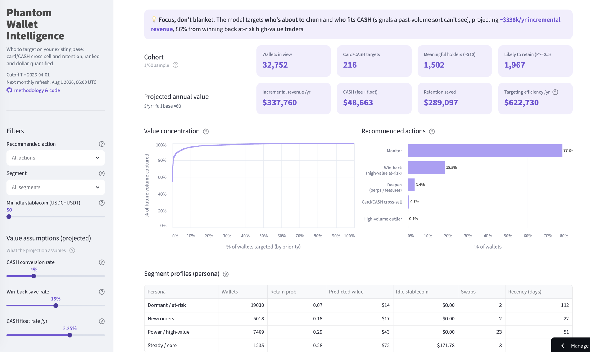

# Phantom Wallet Intelligence

Rank a crypto wallet's existing users for **card/CASH cross-sell and retention** from public on-chain data, and quantify what targeting is worth. Phantom is the worked example; the method generalizes to any consumer wallet.

**🔗 Live demo:** **[phantom-wallet-intelligence.streamlit.app](https://phantom-wallet-intelligence.streamlit.app)**. An interactive dashboard, no install needed. To rebuild from scratch, see [Reproduce locally](#reproduce-locally-dev).

[](https://phantom-wallet-intelligence.streamlit.app)

*Figures and windows are from the current monthly snapshot (cutoff `T` = 2026-04-01); the live dashboard recomputes them on each refresh. The embedded screenshot is illustrative, from an earlier run.*

**Takeaway:** a **retention** model and a **value** model combine into a priority score that beats a naive past-volume sort on the consumer base (**significant at the top quintile**; the top-decile lift is larger but window-dependent), projecting to a tunable **~$0.3M/yr** case. Each model carries its own metric: retention AUC 0.80, priority-score lift, value R², segmentation silhouette. Full results below, *after* the methodology.

## Purpose · audience
- **Why:** a wallet's highest-margin revenue is card interchange (~100-130 bps/swipe) and **CASH float (~3-4%/yr net on idle balances)**, but growth attention is finite, so the question is *which existing users to target*.
- **Purpose:** 
	- Score each existing user by predicted **retention** (stay or not) × **value** (predicted future swap volume),
	- assign a segment + a product-led action, and 
	- put a projected dollar value on targeting the right users vs. treating everyone alike.
- **Audience:** growth PMs, DS reviewers.
- **Data sources:** public Dune data. Card *adoption* is off-chain, so card cross-sell is surfaced as a recommended *action* to test on high-fit users.

## Observation windows
- **Unit:** one wallet.
- **Cutoff `T`** (features dated before T, outcomes measured from T): rolls to the **first of each month**; the current snapshot uses `T` = 2026-04-01.
- **Feature window** = the 6 months before T (**Oct 1 2025 to Mar 31 2026**).
- **Label window** = the 3 months from T (**Apr 1 to Jun 30 2026**): where we observe churn and value.

## Methodology

### Population
- Phantom users identified via Phantom's 8 Solana swap-fee wallets (address list from DefiLlama `fees/phantom.ts`). Fee-attribution is the only public way to find Phantom's *own* customers, and cross-sell needs them.
- Roster size cross-checked against Blockworks' published active-wallet count (~34k daily): [Phantom Total Active Wallets](https://blockworks.com/analytics/phantom/phantom-overview/phantom-total-active-wallets).
- **Scope, disclosed:** fee-paying *Solana swappers*, a subset of all Phantom users.

### Sampling
Keep **~1 in 60 wallets** by a hash of the address (`abs(from_big_endian_64(xxhash64(wallet))) % 60 = 0`): deterministic (same wallets every run), applied to both queries so they join, and selecting on the address alone, so the sample mirrors the population. At n ≈ 32k, any population proportion we report is accurate to ±0.7% (95% CI).

### Features
Engineered from the feature window, then selected: candidates that add no cross-validated improvement are still computed (in `features.py`) but excluded from the model (`FEATURES` in `model.py`).

*Kept (fed to the models):*
- **Recency, frequency, volume**: `recency_days`, `active_days`, `total_swaps`, `total_volume_usd`, `avg_swaps_per_active_day` (USD volume ≈ `fee / 0.85%`). Classic RFM drivers of retention and value.
- **Observed age**: `tenure_days`: days since first activity *within the 6-month window* (left-censored, so read it as observed age; a pre-Oct-2025 user shows the ~182-day cap).
- **Idle stablecoin balance at T**: `idle_stablecoin_usd` (USDC/USDT): the on-brand CASH/card signal.

*Engineered, tested → excluded (no cross-validated improvement over recency):*
- **Trend / momentum**: `recent_volume_share`, `recent_swap_share`, `active_days_last_30d` (recent 30d [T−30→T] vs. preceding 30d [T−60→T−30]).
- **Consistency**: `activity_density` (`active_days / observed age`).

## Models & evaluation

Three models: **two predict, one describes**. Multiplying the two predictors gives one **priority score** = `P(active) × E[value | active]` (expected future value), the ranking used for targeting. (Calibration is a tuning step on model 1, so the count stays three.)

**Shared setup & rigor (all models):**
- **Point-in-time**: features dated ≤ T, outcomes measured after T; the model is trained the way it runs live.
- **Cohort**: wallets active in the feature window (bots filtered out). Models train on all of them; the top-0.1% volume outliers (one ≈ 54% of future volume, likely desks / market-makers / rebalancing) are flagged and split out only when we *report* the lift and assign actions, so the consumer-growth results describe ordinary users.
- **Test set**: every metric is scored on a 30% held-out test set (wallets unseen in training); 5-fold CV confirms consistency.
- **Significance**: effects carry bootstrap 95% CIs; population proportions carry a ±0.7% margin of error (see Sampling).

### Model 1. Retention (gradient-boosting classifier)
- **Predicts:** `P(active)` (0 to 1): "will they stay?"
- **Label:** *retained* = made at least one swap in the label window; *churned* = made none (a yes/no outcome).
- **Measured by:** **AUC**: how reliably it ranks a random *retained* wallet above a random *churned* one (0.5 = chance, 1 = perfect).
- **Result:** **AUC 0.80** on the test set (5-fold CV 0.79 ± 0.01; bootstrap CI [0.788, 0.816]). Top drivers: recency + activity frequency.

### Model 2. Value (gradient-boosting regressor)
- **Predicts:** `E[value | active]`, expected next-quarter USD volume *if* the wallet stays.
- **Label:** USD swap volume in the label window; trained on retained wallets, answering: given a wallet stays, how much will it trade?
- **Measured by:** **R²** in log *and* dollar space (dollar space keeps the heavy tail honest).
- **Result:** the model **orders wallets by value well** (log-R² 0.38) but can't predict the exact **dollar amount** (dollar-R² ≈ 0). The split: a typical wallet's prediction is only ~$52 off, while a few whales' huge volumes are unpredictable and dominate the dollar-scale error. So use it as a **rank**, not a forecast; its payoff is the priority-score lift below.

### Priority score = model 1 × model 2
- **Measured by:** **value-capture lift** vs. the naive baseline (sort by *past* volume, take the top X%): the *extra* future volume captured.
- **Result:** on the consumer base the model beats a past-volume sort at every top-X% cut. The **top quintile is significant** (bootstrap CI above 0); the **top decile is larger (~+5 to 7%) but window-dependent**, with a CI that can span 0, so treat the quintile as the robust claim. On the *full* population the lift shrinks to ~+1%: value is so concentrated (one wallet ≈ 54%) that any sort already captures the outlier, so the consumer-base number reflects skill.

### Model 3. Segmentation (k-means clustering, descriptive)
- **Groups:** wallets by their **7 behavioral features** (not the priority score) into `k` profiles: "what kind of user?"
- **Measured by:** **silhouette** (−1 to 1: how cleanly the groups separate), the unsupervised counterpart to AUC/R², since clustering has no ground-truth label to score against.
- **Result:** silhouette picks **k=4** (*Power/high-value, Steady/core, Dormant/at-risk, Newcomers*); at ~0.33 the groups are broad tendencies. **Descriptive context only, a portrait of the user base, not a decision input:** the priority score and recommended actions don't use it.

## Recommendation & value

For each wallet the models produce three numbers: **retention probability**, **predicted value**, and **idle stablecoin balance**. A rule turns those into **one action**, each with a **projected annual value** (economic model in `valuation.py`, tunable via dashboard sliders). The dollar and count figures below are the **current snapshot (`T` = 2026-04-01)**; `value.py` and the live dashboard recompute them on each refresh. Sizes shown as *sample → full base (×60), % of base*:

- **Card/CASH cross-sell**: sticky (`retain ≥ 0.5`) **and** holds ≥ $10 idle stablecoin → **216 → ~13,000 (0.7%)**. 
	- Prompt them to convert idle USDC → CASH. **≈ $49k/yr** (0.85% swap fee once + ~3.25% net float). *Signal: idle balance + retention, not swap volume.*
- **Win-back**: at-risk (`retain < 0.3`) **and** high predicted value → **6,063 → ~363,800 (18.5%)**. 
	- Re-engagement campaign. **≈ $289k/yr saved** (15% save-rate).
- **Deepen**: sticky **and** high predicted value → **1,117 → ~67,000 (3.4%)**. 
	- Surface perps / new features (a product nudge, not dollar-modeled).
- **Handle 1:1**: high-volume outliers → **33 → ~2,000 (0.1%)**. 
	- Institutional / account-management, not a mass campaign.
- **Monitor**: everyone else → **~1.52M (77%)**. No spend.
- **Prioritization** (cross-cutting): targeting the top decile by priority score reaches **≈ $0.6M/yr** more of next-quarter volume than a past-volume sort, a campaign-efficiency gain, not additive net-new.

**Base-case net-new ≈ $0.3M/yr** (CASH + retention saved), plus the ~$0.6M efficiency. Assumptions: conversion 4%, save-rate 15%, net float 3.25%, fee 0.85%, lift 7%. Exact figures print from `value.py`.

Conversion, save-rate, and float can't be read from on-chain data, so the dashboard exposes them as **sliders**: a PM enters their own estimates and the projection re-runs (a what-if / sensitivity check). The sliders move the *dollar figures* only; the recommended wallets are fixed by the models.

## Limitations
- **Scope: fee-paying Solana swappers**: misses passive holders, NFT/staking/perps-only, and EVM users. This thins the card TAM (~0.7%) and makes the CASH value a floor (idle stablecoins only, though CASH is fundable from any token).
- **Cross-chain identity is unobservable**: a wallet's Solana and EVM addresses have no public link, so a "churned" Solana user may still be active on Base; retention may be *overstated*.
- **Card cross-sell is fit, not intent**: on-chain shows idle balance + stickiness, never whether a user *wants* CASH; it's a hypothesis, and the 4% conversion is assumed, not validated by a holdout.
- **Action thresholds are hand-set**: the 0.5 / 0.3 retention cutoffs are round, not derived from economics.
- **Features are swap-derived only**: no token diversity, portfolio value, or market-regime context; `tenure` is censored to the 6-month window.
- **Single 3-month window**: not backtested across market regimes, and the annual dollar figures annualize ×4 from one quarter.

## Next steps toward production
- **Rolling temporal backtest**: validate the lift across several cutoffs (mean, variance), not a single window.
- **Causal test**: a treatment/holdout experiment (target segments, guardrails, minimum detectable effect) to prove the projected lift and dollar value.
- **Live scoring**: rank wallets from today's features (labels train the model; scoring needs only features), so a campaign acts on current state rather than the cutoff snapshot shown here.
- **Automated snapshot gate**: extend the `features.py` DQ assertions to a committed-snapshot coverage and freshness check.
- **Competitor / TAM depth**: MetaMask Card context and portfolio-wide CASH addressable beyond idle stablecoins.

## Reproduce locally (dev)
For a developer rebuilding the pipeline. End users open the live demo above.
```bash
python -m venv .venv && .venv/bin/pip install -r requirements.txt
export DUNE_API_KEY=...            # only needed to re-extract; the demo runs off the committed snapshot
python features.py                 # build features + labels (DQ-asserted)
python model.py                    # two-stage models + honest eval -> `scored`
python export_demo.py              # scored+features -> snapshot/*.parquet (small, committed)
python value.py                    # projected-value report
streamlit run app.py               # dashboard (reads the committed snapshot)
```
Extraction: `python extract.py` (credit-safe: hash-sampled, chunked, resumable). **After re-running the pipeline, restart Streamlit** (or ⋮ → Clear cache) so it loads the fresh snapshot; `@st.cache_data` keeps the previous load in memory.

Windows roll forward monthly, with `T` anchored to the first of the month (so feature and label windows are whole calendar months); set `PIPELINE_ASOF=YYYY-MM-DD` to pin them for a reproducible rebuild. In production, a monthly GitHub Action (`.github/workflows/refresh.yml`) reruns this pipeline and commits the new snapshot, which redeploys the app.

## Repo structure
- `config.py`: window, cutoff `T`, query ids, sample settings.
- `extract.py`: chunked Dune API → DuckDB (`activity`, `balances_at_t`); credit-safe + resumable.
- `features.py`: per-wallet features + churn/value labels (+ DQ assertions) → `features`.
- `model.py`: two-stage churn + value models, honest eval (baseline lift, bootstrap CIs, calibration, importances), segments → `scored`.
- `valuation.py` / `value.py`: economic assumptions + projected-value report.
- `export_demo.py`: copies `scored`+`features` into `snapshot/*.parquet` for deploy (version-independent).
- `app.py`: Streamlit dashboard.
- `.github/workflows/refresh.yml`: monthly cron that rebuilds and commits the snapshot (auto-redeploys the app).
- `sql/`: Dune queries (`transfers_chunk.sql`, `balances_at_t.sql`).
- `data/`: full pipeline DB (gitignored). `snapshot/`: committed Parquet the app reads.

## Sources
- Card economics (interchange ~100-130 bps; CASH float ~3.5%/yr net). CASH issued via [Bridge Open Issuance (Stripe)](https://stripe.com/blog/introducing-open-issuance-from-bridge); net float ≈ 3-mo T-bill yield (~3.7%, Jul 2026) less Bridge's issuance fee.
- Fee wallets: DefiLlama `fees/phantom.ts`. Active wallets: [Blockworks Phantom analytics](https://blockworks.com/analytics/phantom/phantom-overview/phantom-total-active-wallets). Product-led "superapp" strategy: Forbes (Feb 2026); "no token" stance: Cointelegraph (Jan 2025).
